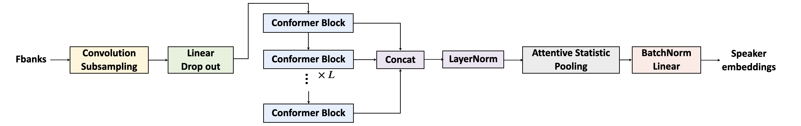
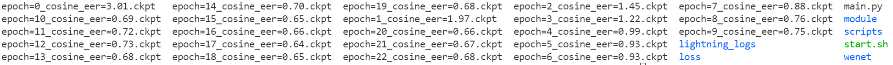

# MFA-Conformer

This repository contains the training code accompanying the paper "MFA-Conformer: Multi-scale Feature Aggregation Conformer for Automatic Speaker Verification", which is submitted to Interspeech 2022.

<p align="center"></p>

The architecture of the MFA-Conformer is inspired by recent state-of-the-art models in speech recognition and speaker verification. Firstly, we introduce a convolution subsampling layer to decrease the computational cost of the model. Secondly, we adopt Conformer blocks which combine Transformers and convolution neural networks (CNNs) to capture global and local features effectively. Finally, the output feature maps from all Conformer blocks are concatenated to aggregate multi-scale representations before final pooling. The best system obtains 0.64%, 1.29% and 1.63% EER on VoxCeleb1-O, SITW.Dev, and SITW.Eval set, respectively. 

## Data Preparation

* [VoxCeleb 1&2](https://www.robots.ox.ac.uk/~vgg/data/voxceleb/)
* [SITW](http://www.speech.sri.com/projects/sitw/)

```bash
# format Voxceleb test trial list
rm -rf data; mkdir data
wget -P data/ https://www.robots.ox.ac.uk/~vgg/data/voxceleb/meta/veri_test2.txt
python3 scripts/format_trials.py \
            --voxceleb1_root $voxceleb1_dir \
            --src_trials_path data/veri_test.txt \
            --dst_trials_path data/vox1_test.txt

# make csv for voxceleb1&2 dev audio (train_dir)
python3 scripts/build_datalist.py \
        --extension wav \
        --dataset_dir data/$train_dir \
        --data_list_path data/train.csv
```

## Model Training

```bash
python3 main.py \
        --batch_size 200 \
        --num_workers 40 \
        --max_epochs 30 \
        --embedding_dim $embedding_dim \
        --save_dir $save_dir \
        --encoder_name $encoder_name \
        --train_csv_path $train_csv_path \
        --learning_rate 0.001 \
        --encoder_name ${encoder_name} \
        --num_classes $num_classes \
        --trial_path $trial_path \
        --loss_name $loss_name \
        --num_blocks $num_blocks \
        --step_size 4 \
        --gamma 0.5 \
        --weight_decay 0.0000001 \
        --input_layer $input_layer \
        --pos_enc_layer_type $pos_enc_layer_type 
```

## Results

The training results of default configuration is prestented below (Voxceleb1-test):

<p align="center"></p>

## Others

What's more, here are some tips might be useful:

1. **The Conformer block**: We the borrow a lot of code from [WeNet](https://github.com/wenet-e2e/wenet) toolkit. 
2. **Average the checkpoint weights**: When the model training is done, we average the parameters of the last 3~10 checkpoints to generate a new checkpoint. The new checkpoint always tends to achieve a better recognition performance.
3. **Warmup**: We perform a linear warmup learning rate schedule at the first 2k training steps. And we find that this warmup procedure is very helpful for the model training.
4. **AS-norm**: Adaptive score normalization (AS-norm) is common trick for speaker recognition. In our experiment, it will lead to 5%-10% relative improvement in EER metric.

## Citation

If you find this code useful for your research, please cite our paper.

```
@article{zhang2022mfa,
  title={MFA-Conformer: Multi-scale Feature Aggregation Conformer for Automatic Speaker Verification},
  author={Zhang, Yang and Lv, Zhiqiang and Wu, Haibin and Zhang, Shanshan and Hu, Pengfei and Wu, Zhiyong and Lee, Hung-yi and Meng, Helen},
  journal={arXiv preprint arXiv:2203.15249},
  year={2022}
}
```
